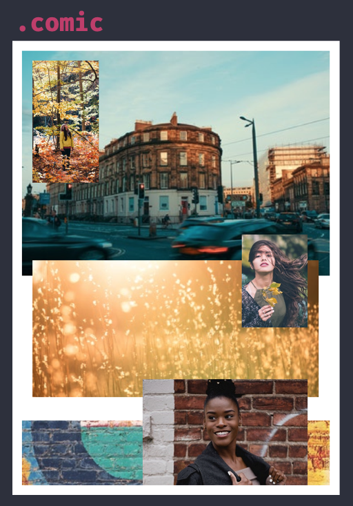
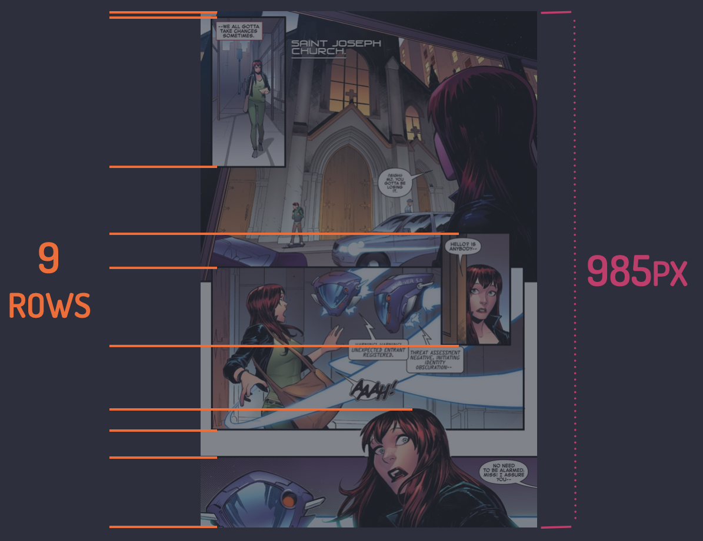
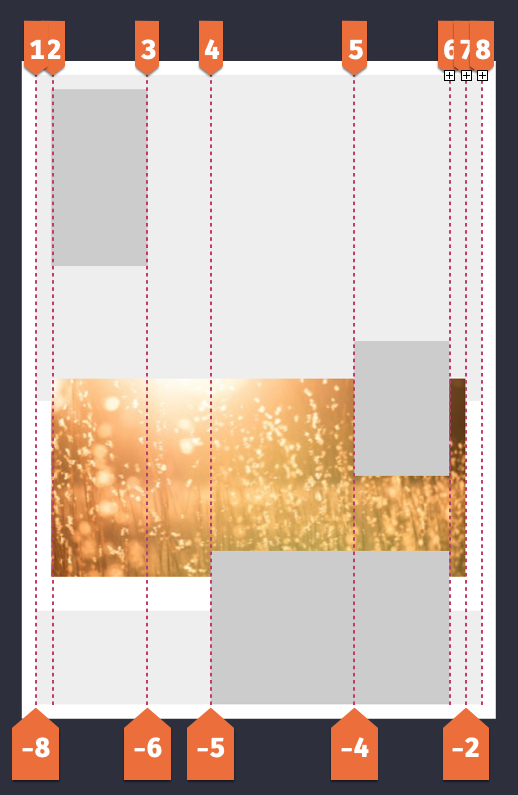
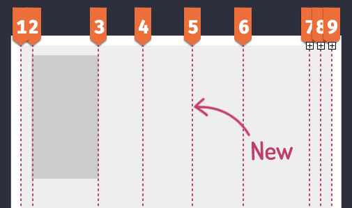
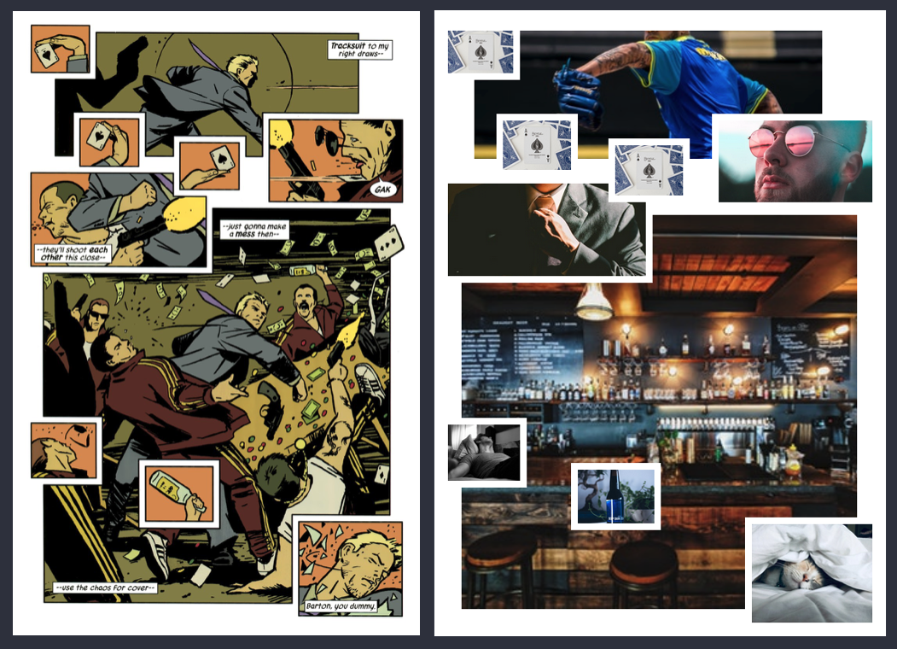

Feel free to jump straight to the [CodePen example](https://codepen.io/antonjb/pen/yrmQez).

Welcome to part three of the Superhero Layout series. We have looked at the golden age of comics and staggered panels in part one, then CSS Subgrid and creating merged panels in part two. The next evolution came in the form of layering panels. Artists utilised overlapping panels to create depth, action and detail in comic storytelling.

We revisit the world of Spider-man, not because it’s the only series to do this, but because it’s a favourite of mine!


Artists added detail elements to expand the story without taking too much space. Layering is by no means new to web layout but what CSS Grid enables us is a simpler, predictable approach than float and absolute positioning options.

## Creating the grid
So far in the series we relied on implicit grid sizing but we are changing things up to explicit sizing now. It’ll make positioning panels easier when using line numbers - you’ll see this soon. Here’s the layout we are going to create based on Spider-man 2018.



First up is our container element, comic.

```css
.comic {
  display: grid;
  grid-template-columns: 1fr 6fr 4fr 9fr 6fr repeat(2, 1fr);
  grid-template-rows: 16px 2.35fr 1fr 0.5fr 0.3fr
                      1fr 1fr 0.35fr 0.45fr 1.25fr;
}
```

Whoa, those column and row values are looking a bit intimidating. Back [in part one of the series](/blog/2020-02-20-super-hero-layout-staggered-grid/) we calculated the total width, divided by the smallest panel to return the smallest possible panel. We are going to use similar techniques to achieve our row and column values.




Drawing a line where each panel starts and ends gives us an idea that we need nine rows. The total height of the page is 985px. Dividing the height (985px) by the number of rows (9) gives us 109px. 109px represents 1/9 of our grid. Assuming all rows are equal.


If one panel is 291px in height and we divide that by our base fraction (109px) we end up with a value of 2.6. The height of this row in our grid is, 2.6fr.

Why not just use pixels? We could use pixels, they would work in certain scenarios, but we can’t easily resize our grid that way. Fractions units mean each panel will always be the same size relative to the parent. Useful when we start implementing responsive design.

Repeating this process for each panel (rows and columns) gives the values for grid-template-rows and grid-template-columns that we saw earlier.


Now we need to start laying our panels out in our newly sized comic. Here’s the CSS.

```css
.panel-3 {
  grid-row: 4 / 7;
  grid-column: 5 / span 1;
  z-index: 1;
}

.panel-4 {
  grid-row: 5 / 9;
  grid-column: 2 / -2;
}
```

Positioning our panels is done by setting the grid-row and grid-column to values representing their position within the grid. How does CSS Grid understand a value such as 2 / -2 though?

Grid lines are numbered from 1 (not 0 like many programming languages) to the total number of lines, in our case, that’s 8.


That makes the starting line for this panel 2. A nifty little trick from CSS Grid though, is lines are numbered in reverse too!



Our panel is two lines from the right. Using the image above we can use the value -2. Why is this useful? Imagine when we need to modify our layout, say adding a new row in the middle. That’s grid line 5 in this image.



Any grid item that had a number above 5 would need to increase by 1.

```css
.panel-4 {
  grid-column: 2 / 7;  // off by one
  grid-column: 2 / 8;
}
```

Conversely, using -2 the new line wouldn’t affect this value. Handy! You’ll thank the previous you for thinking of this.

Browser tools have some great ways to visualise Grid line numbers. [Check out Firefox’s grid inspector](https://developer.mozilla.org/en-US/docs/Tools/Page_Inspector/How_to/Examine_grid_layouts) in the developer tools. Chrome isn’t too far behind with their offering either. Thanks browsers!

We now have the tools to position each panel within the layout and create the full comic.

## Accessibility
Layering is an exciting addition to our layout tool boxes. But, we need to consider more than the layout it enables. Sticking with the Spider-man theme, and to quote the great Uncle Ben, “with great power, comes great responsibility!”.

There’s an inherent danger when we can position an element anywhere on the page. If the HTML source order isn’t written in a way that makes sense, you negatively impact the accessibility of your page.

Let’s take a look at our example to see how:


Screen readers only pay attention to the HTML. When creating our layout, if we decided the fourth panel was better suited in the first-panel position, we can move it using these techniques. The grid-row becomes 1 / 6. But now the HTML doesn’t make sense and will be read out of order to the visual appearance.

Solely changing the visual layout does not tell the browser that the source order has changed and could, therefore, let those interacting with your sites in other ways from getting the information they require.

## More layers
The modern age of comics made prolific use of layering. It’s an approach to break free of boxes that have constrained designs and layout for many years.

One last example is Hawkeye #1, alongside the recreation in CSS Grid.



Adding thick borders to certain images gives the impression of a unique Grid gap. This is created using the techniques from above so I won’t run through how this was created, instead encourage you to [have a look at the example on CodePen](https://codepen.io/antonjb/pen/zQOvqa) instead.

That wraps up the third part of Superhero Layouts. You can take a look at the [example based on Spider-man](https://codepen.io/antonjb/pen/yrmQez) and the [example based on Hawkeye](https://codepen.io/antonjb/pen/zQOvqa) on CodePen. Be on the look out for the next article in the series. Because we are going to explore how when combining CSS Grid and CSS Shapes makes our layouts truly super!

## Posts in the Superhero Layout series
* [Staggered CSS Grid](/blog/2020-02-20-super-hero-layout-staggered-grid/)
* [CSS Subgrid](/blog/2020-03-10-super-hero-layout-css-subgrid/)
* [CSS Layering Panels](/blog/2020-05-19-super-hero-layout-layered-panels/)
* [CSS Shapes](/blog/2020-08-05-super-hero-layout-css-shapes/)
* [CSS Text Shapes](/blog/2020-09-19-superhero-layout-css-text-shapes/)
* [CSS internationalisation](/blog/2020-10-19-superhero-layout-internationalisation/)

## Thanks
Thanks to [Patima Tantiprasut](https://twitter.com/the_patima), [Corey Ginnivan](https://twitter.com/CoreyGinnivan) and [Dominic Sebastian](https://twitter.com/dominosebastian) for their valuable review feedback on this post.
