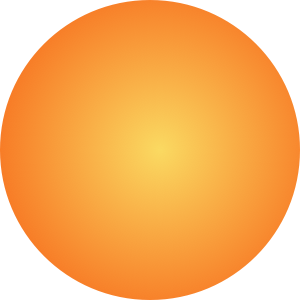

Building a component library within a JavaScript library, such as React or Vue, often means having a lot of SVG components built in isolation. They represent application icons, brand logos and background images. We had a little reminder about the importance of unique IDs within a HTML document and our SVG icons recently.

Let's use a gradient square to represent an icon component.


A workflow for converting an SVG to a component could be optimising the SVG in Jake Archibald’s fantastic [SVGOMG](https://jakearchibald.github.io/svgomg/) or a handy conversion tool like [SVG2JSX](https://svg2jsx.com/) to move straight to JSX.

As with all projects, we will need more icons in our project, this time a circle.



Both icons work great, but strange things happen when used on the same page. Both icons become the same colour! Assuming the square icon appears in the markup first, we end up with this:


Why have both icons ended up with the same gradient? If we take a look at the code of the icons we can start to determine why.

```jsx
const SquareIcon = () => (
    <svg
      xmlns='http://www.w3.org/2000/svg'
      width='82'
      height='82'
      viewBox='0 0 82 82'
    >
      <defs>
          <linearGradient id='a' x1='0%' x2='102%' y1='0%' y2='101%'>
              <stop offset='0%' stopColor='#3023AE'></stop>
              <stop offset='100%' stopColor='#C86DD7'></stop>
          </linearGradient>
      </defs>
      <path fill='url(#a)' d='M0 0h82v82H0z'></path>
    </svg>
)
```

```jsx
const CircleIcon = () => (
    <svg
        xmlns='http://www.w3.org/2000/svg'
        width='150'
        height='150'
        viewBox='0 0 82 82'
    >
      <defs>
          <radialGradient id='a' cx='53.314%' cy='50%' r='62.917%' fx='53.314%' fy='50%'>
              <stop offset='0%' stopColor='#FAD961'></stop>
              <stop offset='100%' stopColor='#F76B1C'></stop>
        </radialGradient>
      </defs>
      <circle cx='41' cy='41' r='41' fill='url(#a)'></circle>
    </svg>
  )
```

It’s tricky to spot and a head-scratcher to solve. Especially when running through a process where taking the design and generating SVG code from Sketch or an optimiser. Take a closer look at the fill URL and we can start to see what’s going wrong.

```js
// Square icon fill
<path fill='url(#a)' d='M0 0h82v82H0z'></path>

// Circle icon fill
<circle cx='41' cy='41' r='41' fill='url(#a)'></circle>
```

Both are referring to fills with an id of `a`. An id within a HTML document must be unique for the whole document. Meaning that fill=’url(#a)’ is always referring to the first instance of the gradient - in our case the linear gradient.

## What can we do?
The solution is going to depend on your setup. If you’re using SVGO there’s a lively discussion on an [issue raised that suggest generating unique IDs](https://github.com/svg/svgo/issues/674). Discussion aside there’s the ability to add a prefix to the cleanupIDs parameter along with a few implementation suggestions.

If you don’t have many SVGs you could manually rename fill ids to be unique. A name that’s relevant to the icon, such as `linearGradientSquareIcon` and `radialGradientCircleIcon` respectively would work just fine.

An NPM package such as UUID to generate unique IDs for each fill is another option. The downside is remembering to update IDs when creating and updating the icon!

Feel free to [take a look at the CodePen setup](https://codepen.io/antonjb/pen/JjGPbyy) I used to create the examples. If you know more robust solutions then let’s chat! Otherwise, hope you find this helpful if you happen to run into this issue yourself.
