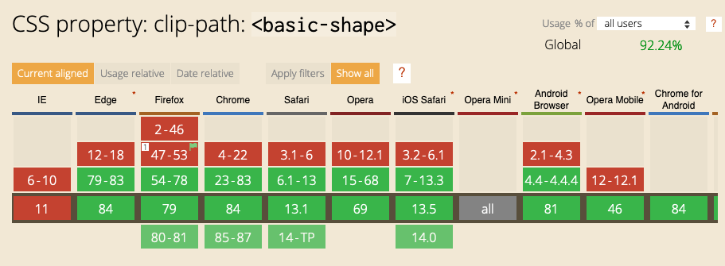

import Video from '@/components/video.astro'
import clipPathVideo from '@/assets/shl-shapes/clip-path.mp4'

---
title: "Superhero Layout - Combining CSS Grid and CSS Shapes"
date: 2020-08-05T00:00:00.000Z
heroImage: ../assets/shl-shapes/shapes-hero.png
description: >-
  Combining CSS Grid with CSS Clip-Paths to recreate a unique layout based on a comic book.
tags:
  - css
  - grid
  - super-hero-layout
---

Welcome to part four of the CSS Grid Layout series! In this part we combine the techniques from our previous posts with CSS Shapes to create a comic book layout with uniquely shaped panels. If you want to, you can [jump straight to the CodePen demo](https://codepen.io/antonjb/pen/mYyJvj). If you need a refresher on the previous posts take a look at [staggered panels](/blog/2020-02-20-super-hero-layout-staggered-grid/), [layering panels](/blog/2020-05-19-super-hero-layout-layered-panels/) and [CSS Subgrid](/blog/2020-03-10-super-hero-layout-css-subgrid/). Let’s get into it.

Here's the inspiration for our layout, from Generations: Phoenix and Jean Grey by Marvel Comics.


It’s nice to see a layout that breaks out of the box. It’s even nicer that this is possible with CSS Grid. Everything we create is still going to be a rectangle, you can’t create a grid area that isn’t rectangular, but with clip-path, we can give the illusion of any shape we like.

Before we get started, browser support. IE11 doesn’t support clip-path and that isn’t going to change, so you’ll need to consider alternatives but with Edge swapping to Chromium we now have pretty great access to clip-path across browsers.


[Can I use CSS Property clip-path](https://caniuse.com/#feat=mdn-css_properties_clip-path_basic_shape)

Let’s get started with the container of our comic.


```css
.comic {
  position: relative;
  background-image: url(space.jpg);
  background-size: cover;
  background-position: center;
  overflow: hidden;
}
```

The comic consists of five panels each with an image inside.


```css
.panels {
  display: grid;
  grid-template-columns: 3fr repeat(4, 1fr) 2fr;
}
```

You’re right to be wondering why there are only two visible images - the panels are overlapping. This is needed because the angles we create overlap and we need the image to be visible. If each was in its cell we wouldn’t get the same effect.


If we look at the layering in 3D - [thanks to Mandy Michael for this technique](https://medium.com/javascript-in-plain-english/creating-3d-layout-with-css-using-grid-perspective-65cd03dfc56c) - we get a better idea of how the layers overlap.

The panels container is rotated and absolutely positioned to where it needs to be.


```css
.panels {
  display: grid;
  grid-template-columns: 3fr repeat(4, 1fr) 2fr;
  position: absolute;
  left: -20%;
  right: -20%;
  bottom: -10%;
  top: 20%;
  transform: rotate(-20deg) translateY(100px);
}
```

## Clip-path

Now we get to make the fancy shapes using clip-path! Because it’s vital to this technique, let’s look at how clip-path works.


```css
.panel-3 {
  clip-path: polygon(0 18%, 20% 20%, 78%
                     71%, 63% 100%, 5% 80%);
}
```

Clip-path changes the panel’s visible area by setting a shape (polygon in this example) by providing x,y value pairs for each node in the shape. Anything outside of the path is clipped away, leaving the shape we have created. Handy.

When applied to each panel in our comic, we get the following:


Quoting Bon Jovi - “whoa, we are halfway there!”. Our layout is most of the way to being what the comic inspired us to be. Great.

```css
.panel-1 {
  grid-column: 1 / 1;
  grid-row: 1;
  clip-path: polygon(0 2%, 98% 15%,
                     89% 100%, 0 100%);
}

.panel-2 {
  grid-column: 1 / span 3;
  grid-row: 1;
  z-index: 1;
  clip-path: polygon(59% 16%, 80% 18%,
                     86% 100%, 54% 100%);
}
```

## Clip-path in the dev tools

Clip-path values aren’t something I could determine just by looking at an image. Thankfully [Firefox’s Shape Path Editor](https://developer.mozilla.org/en-US/docs/Tools/Page_Inspector/How_to/Edit_CSS_shapes) allows you to interactively drag nodes and create the shape you need right in the browser. I took those values from the browser into the code.

<Video src={clipPathVideo} />

The last part to recreate is the image borders. Sadly we can’t use CSS borders because clip-path hides content outside the clip path, which would include said borders. So we needed another idea.


```css
.panel-1 {
  grid-column: 1 / 1;
  grid-row: 1;
  clip-path: polygon(1% 2%, 98.5% 15.75%,
                     89% 100%, 0 100%);
  background-color: #fff;
}

.panel-1 img {
  clip-path: polygon(1% 2%, 98.5% 15.75%,
                     89% 100%, 0 100%);
  transform: scale(0.95);
  transform-origin: 70% 22%;
}
```

To achieve the border, set the background colour on the div to white, then add the same clip-path to the image within the div, scaling the image down so the background becomes visible. Because of the funky shapes we need to set the offset position as they aren’t quite square. We now have the “borders”.

A downside of this technique is you are setting the grid-gap manually because you’re clipping and overlapping. So you’ll need to be accurate if you decide to have a gap.


There we go. We have recreated the comic layout, even with its unique shapes right in the browser. [Take a look at this example on CodePen](https://codepen.io/antonjb/pen/mYyJvj) to see it in action.

Combining clip-path and grid can lend itself to great new layout options. If we combine it with what we learnt about layering in part 3 we can recreate this layout from Detective Comics 876 - published by DC Comics.


This [Detective Comics inspired layout is also available on CodePen](https://codepen.io/antonjb/pen/EJOLMx) if you’d like to take a look.

Clip-path has other shapes available too. Polygon is great for making lots of edges but we we can also create an ellipse or a circle with the following code.


If we combine our superpowers of CSS Grid, polygon, circle and ellipse clip paths then we can even recreate this wild layout from the Flash Comic series. Again, [you can preview this layout on CodePen](https://codepen.io/antonjb/pen/JqjdBr).


I hope these examples have inspired you to think outside the box with layouts. Combining CSS Grid with clip-path can open up layout to some amazing possibilities. If you’d like to take a look at the examples on CodePen here are the links for The [Phoenix inspired layout](https://codepen.io/antonjb/pen/mYyJvj), [Detective Comics inspired layout](https://codepen.io/antonjb/pen/EJOLMx) and [Flash inspired layout](https://codepen.io/antonjb/pen/JqjdBr).

In the next part of the series we take a similar approach with paths but look at how CSS Shapes can make text wrap around our pictures.

Posts in the Superhero Layout series

## Posts in the Superhero Layout series
* [Staggered CSS Grid](/blog/2020-02-20-super-hero-layout-staggered-grid/)
* [CSS Subgrid](/blog/2020-03-10-super-hero-layout-css-subgrid/)
* [CSS Layering Panels](/blog/2020-05-19-super-hero-layout-layered-panels/)
* [CSS Shapes](/blog/2020-08-05-super-hero-layout-css-shapes/)
* [CSS Text Shapes](/blog/2020-09-19-superhero-layout-css-text-shapes/)
* [CSS internationalisation](/blog/2020-10-19-superhero-layout-internationalisation/)

## Thanks
Thanks to [Mandy Michael](https://twitter.com/mandy_kerr) for [the post on perspective layout](https://medium.com/javascript-in-plain-english/creating-3d-layout-with-css-using-grid-perspective-65cd03dfc56c) and reviewing this post. Appreciate it.
